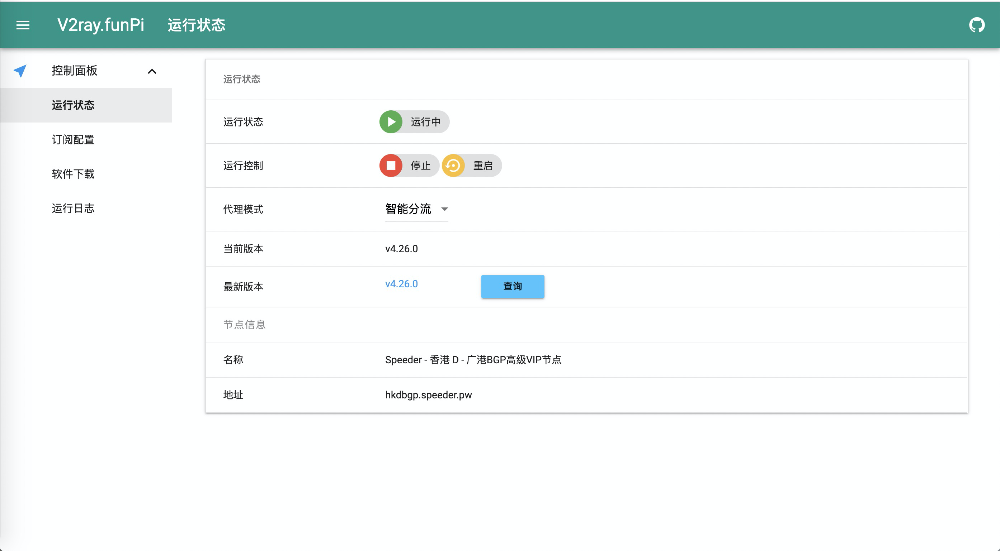
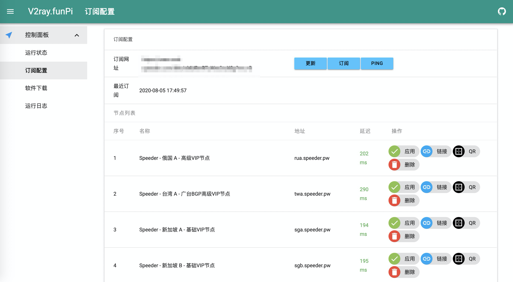
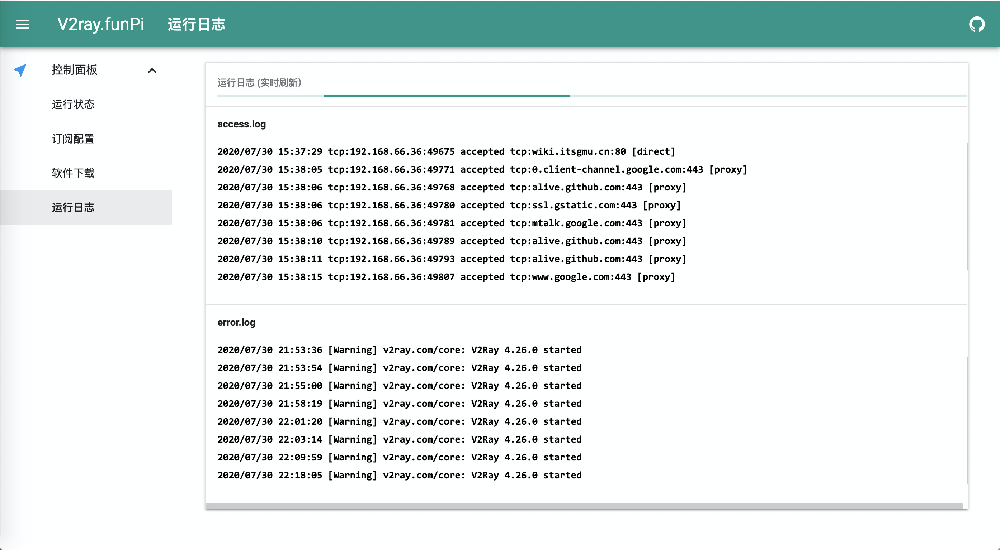

## 简介

一个基于 Web 的 V2ray 控制面板，已改造为将树莓派作为旁路由使用，只需要设置好网关，支持直连\智能分流\全局代理 三种模式，并能自动管理订阅，原理参考 [透明代理(TPROXY)
](https://guide.v2fly.org/app/tproxy.html#%E5%BC%80%E6%9C%BA%E8%87%AA%E5%8A%A8%E8%BF%90%E8%A1%8C%E9%80%8F%E6%98%8E%E4%BB%A3%E7%90%86%E8%A7%84%E5%88%99)







## 系统支持
Raspbian 9

## 安装方式
```
sudo su - root
cd /usr/local
git clone git@github.com:twotreesus/V2ray.FunPi.git V2ray.Fun
cd V2ray.Fun/script
./install.sh
```

## 配置方式
修改配置文件

```
sudo nano /usr/local/V2ray.Fun/config/app_config.json
{
    "user": "admin",
    "password": "admin",
    "port": 1099,
    "subscribe": "https://www.xxx.com/link/xxx",
    "last_subscribe": 1596112704,
    "proxy_mode": 1
}
```
重启服务

```
sudo supervisorctl restart v2ray.fun
```
